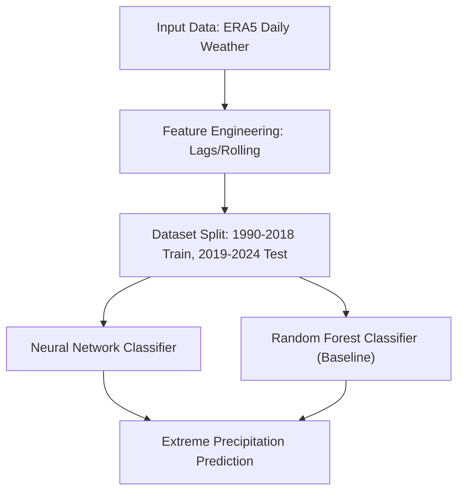
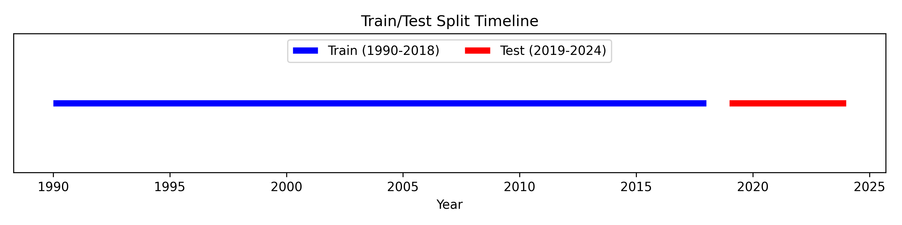
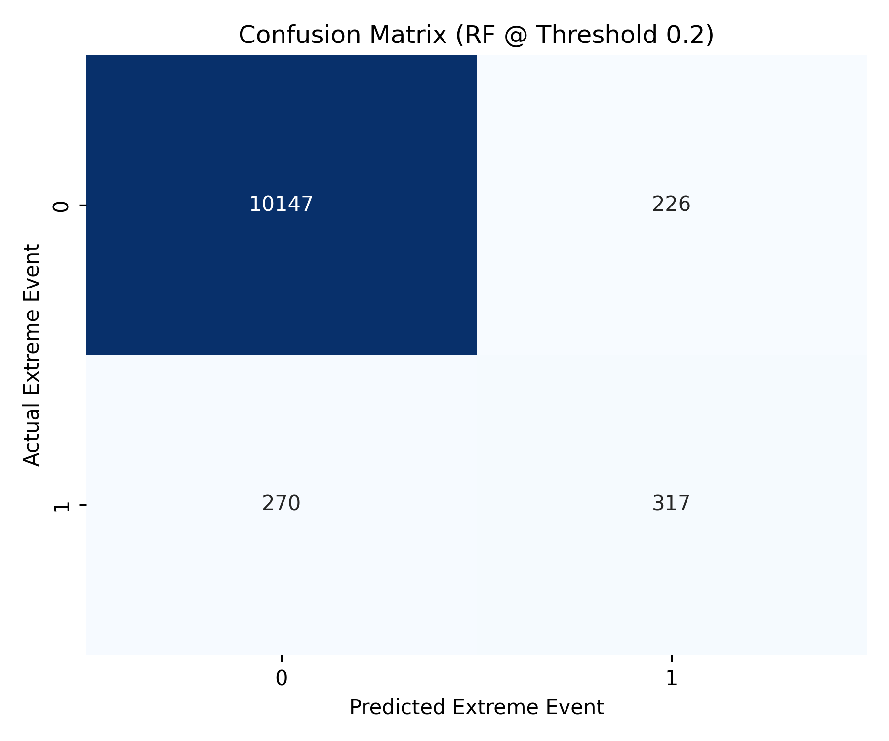
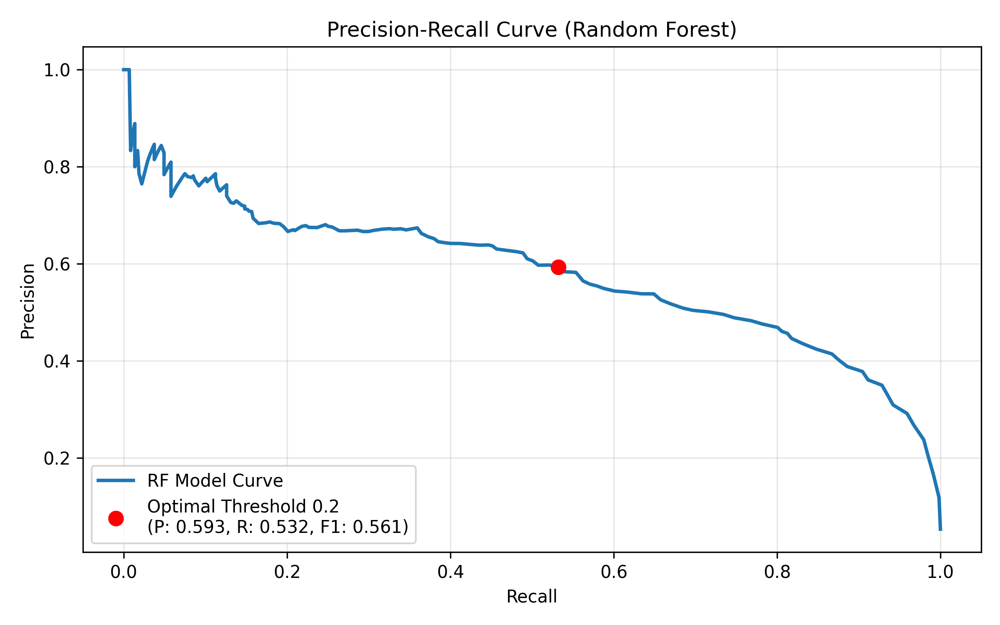
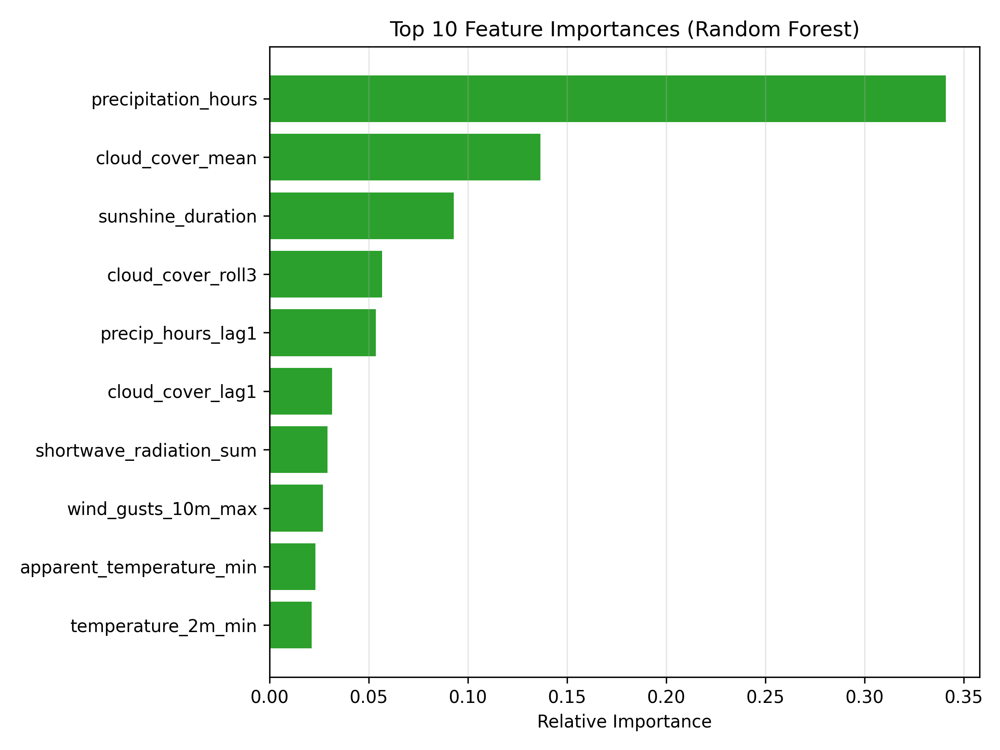

# Extreme Precipitation Classifier (Karakoram / Gilgit-Baltistan)

A binary classifier predicting extreme precipitation days across five Gilgit-Baltistan weather stations, built on the Karakoram ERA5 Climate Dataset. This project was primarily a hands-on exercise in end-to-end ML: data leakage auditing, time-based validation, class imbalance handling, and feature engineering, using GPU training on Kaggle for the first time.

**This is not a flood prediction system.** It predicts extreme precipitation days as a proxy for flood risk. Read the Limitations section before drawing any conclusions from it.

## Data

- Source: [Karakoram ERA5 Climate Dataset](link-to-your-dataset) (own dataset, published on Kaggle/Zenodo)
- 63,920 daily records, 1990-2024, 5 stations: Gilgit, Skardu, Hunza, Chilas, Khunjerab
- Bias-corrected for a known ERA5 2016 assimilation discontinuity (see dataset repo for details)

## Label definition

"Extreme" is defined per station, not globally, since baseline precipitation varies a lot with elevation and local climate:

```
extreme_threshold = station_mean + 2 * station_std
is_extreme = precipitation_sum > extreme_threshold
```

Resulting class balance: 95.5% normal days, 4.5% extreme days.

## Data leakage audit

Several columns were dropped because they were used to build the label, or were arithmetically/categorically redundant with it:

| Column | Reason dropped |
|---|---|
| `precipitation_sum` | Used directly to build the label |
| `rain_sum`, `snowfall_sum` | Sum together into precipitation_sum |
| `weather_code` | WMO codes for rain/snow intensity (61-65, 71-75) overlapped 100% with `is_extreme` in spot checks |
| `sunrise`, `sunset` | Redundant with `daylight_duration`, which is already computed |
| `era5_period`, `bias_corrected` | Redundant with `year`/`month`, describe data processing not weather |
| `station`, `district` | Kept as `lat`/`lon`/`elevation_m` instead, so the model generalizes to unseen coordinates rather than memorizing 5 fixed station names |

Final feature set: 25 columns (weather variables, geography, time, plus lag/rolling features below).

## Repository Structure

```
.
├── extreme-weather-prediction.ipynb
├── figures/
│   ├── confusion_matrix.png
│   ├── feature_importance.png
│   ├── precision_recall.png
│   └── timeline.png
├── generate_plots.py
├── LICENSE
├── random_forest.ipynb
├── README.md
└── requirements.txt
```

## Architecture



## Visualizations

### Train/Test Split Timeline


### Confusion Matrix (Random Forest)


### Precision-Recall Curve


### Top 10 Feature Importances


## Methodology

- **Split:** time-based, not random. Train on 1990-2018, test on 2019-2024. Random shuffling would leak adjacent-day information (today's weather is highly correlated with yesterday's), inflating test performance artificially.
- **Scaling:** StandardScaler fit only on training data, applied to test data. Fitting on the full dataset would leak test-set statistics into preprocessing.
- **Class imbalance:** handled with `class_weight='balanced'` rather than resampling.
- **Model:** small feedforward neural network (64 → 32 → 1, sigmoid output), trained on Kaggle GPU (Tesla T4/P100).
- **Feature engineering:** added 1-day lag and 3-day rolling averages (precipitation hours, cloud cover, wind speed), calculated per-station to avoid mixing timelines across locations.

## Results: Neural Network

The primary model is a small feedforward neural network, which was trained on Kaggle using GPU acceleration. It was evaluated on held-out 2019-2024 data (587 real extreme days out of 10,960).

| Threshold | Precision | Recall | F1 |
|---|---|---|---|
| 0.3 | 0.315 | 0.942 | 0.473 |
| 0.5 | 0.374 | 0.879 | 0.525 |
| 0.7 | 0.444 | 0.790 | 0.568 |

Adding lag/rolling features improved both precision and recall at every threshold compared to the baseline (single-day snapshot) model, for example at threshold 0.5: recall rose from 0.852 to 0.879, precision from 0.359 to 0.374.

At the lower thresholds, the model catches the large majority of real extreme events, at the cost of a high false positive rate. This tradeoff was chosen deliberately: missing a real extreme event is considered more costly than a false alarm, but the false alarm rate is high enough that this would need real improvement before being useful in practice.

The Neural Network outperformed the Random Forest baseline in terms of recall and overall F1-score optimization for this specific use case.

## Baseline comparison: Random Forest

To check whether the neural network is actually earning its complexity, a Random Forest (200 trees, `class_weight='balanced'`) was trained on the same features (unscaled, since tree splits don't require normalized inputs).

| Model | Threshold | Precision | Recall | F1 |
|---|---|---|---|---|
| Neural net | 0.7 | 0.444 | 0.790 | 0.568 |
| Random Forest | 0.2 | 0.593 | 0.532 | 0.561 |

Best-case F1 is nearly identical between the two, but the shape of the tradeoff differs a lot. Random Forest is more precise when it commits to a prediction, but far more conservative, its recall tops out around 0.53 even at its loosest threshold, well below what the neural net achieves even at its strictest threshold. Given that missed extreme events are considered more costly than false alarms for this use case, the neural net's ability to reach much higher recall makes it the better fit here, despite Random Forest's cleaner-looking precision.

Random Forest's feature importances also validate the lag/rolling feature engineering: `precipitation_hours` and `cloud_cover_mean` (same-day values) dominate, but `cloud_cover_roll3`, `precip_hours_lag1`, and `cloud_cover_lag1` combined account for roughly 14% of the model's decisions, confirming the engineered buildup features carry real signal rather than noise. Notably, geography (`lat`, `lon`, `elevation_m`) ranked low in importance, most of the signal comes from same-day and recent atmospheric conditions rather than location.

## Limitations (read this before using this for anything real)

- Predicts extreme precipitation, not floods. Actual flood risk depends on soil saturation, snowmelt timing, terrain/drainage, and river discharge, none of which are in this model.
- Precision at recall-optimized thresholds is low (roughly 30-40%), meaning frequent false alarms.
- Only 587 extreme events in the test set. Not a large sample to be confident this generalizes to storm patterns outside the historical record.
- No baseline comparison yet against simpler methods (e.g. a fixed percentile rule). It's possible a much simpler heuristic performs comparably; this hasn't been checked.
- Single-day daily resolution, no sub-daily or multi-station spatial interaction modeling.

## Next steps

- Add multi-day rolling precipitation sums as features
- Explore whether nearby-station conditions (e.g. upstream stations) improve prediction
- Consider terrain/drainage features if a suitable dataset can be found

## Acknowledgments

Built on the Karakoram ERA5 Climate Dataset (CC BY 4.0), created by the same author.
